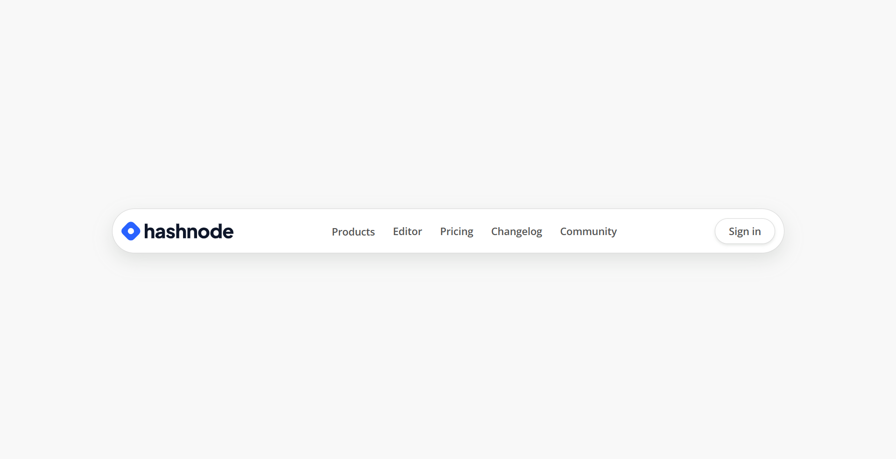
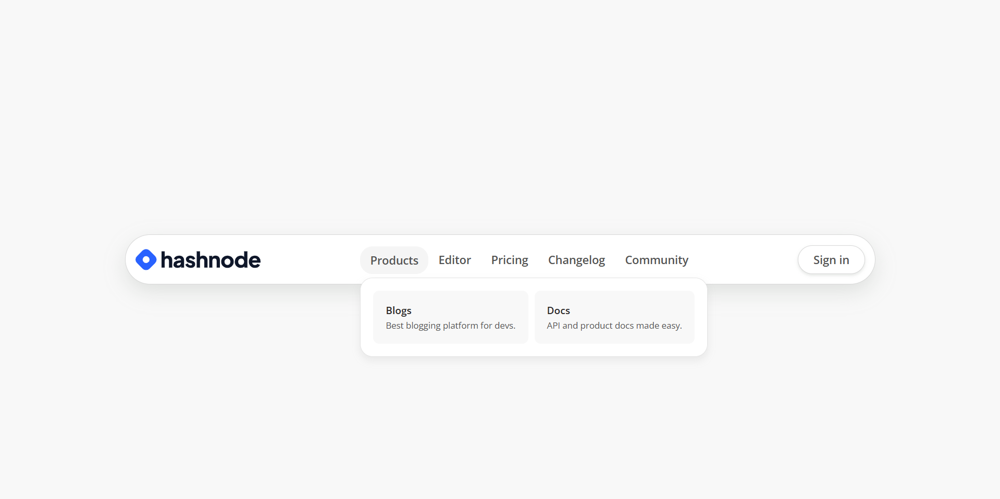

# Hashnode Navbar

## Project Overview

### Description

A clean navbar inspired by Hashnode, with links, dropdown, and smooth hover effects.

➡️[Live Link](https://simple-login-card.vercel.app/)

### Screenshots

### Technologies Used

- **Figma** – Designed the layout and visuals.
- **HTML** – Structured the navbar elements.
- **CSS** – Styled the navbar and added hover effects.

### Learnings & Outcome

- Improved HTML structuring skills.
- Gained experience with dropdown menus and hover effects.
- Learned to use box shadows, transitions, and font styling for modern UI.

### Connect with Me

Stay connected and explore more of my work:

Thank you for checking out my project! Let’s stay connected and build something amazing. **Happy coding!** 🚀
